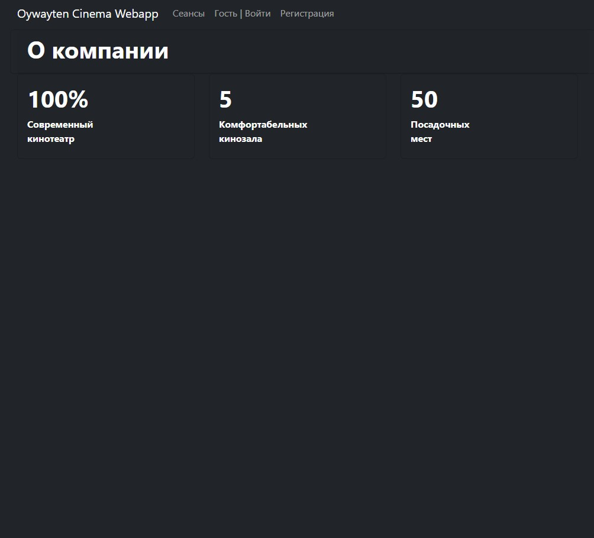
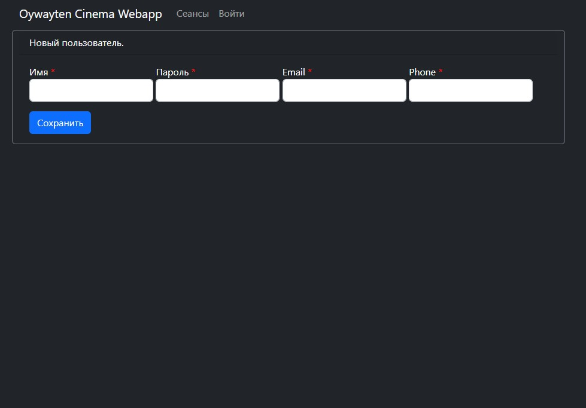
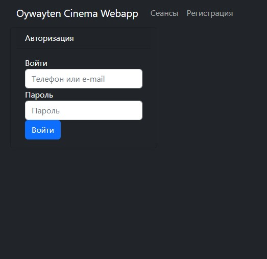
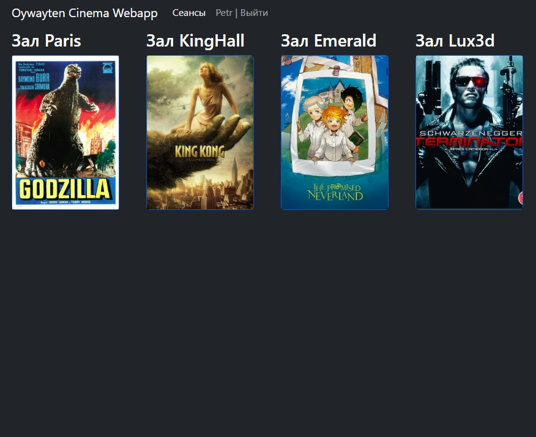
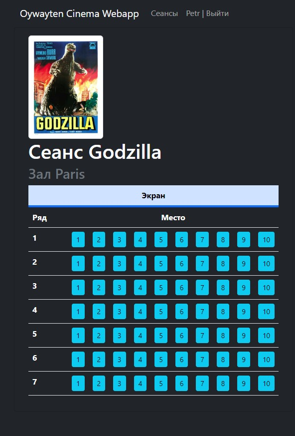
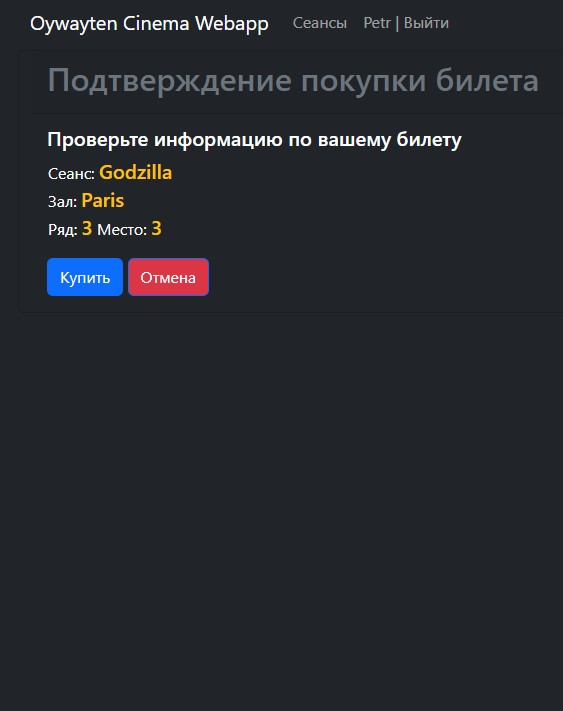
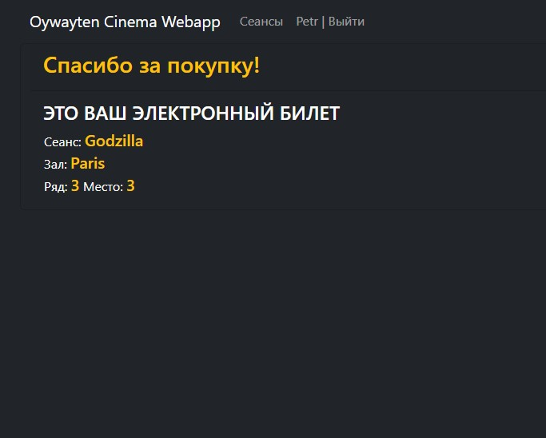
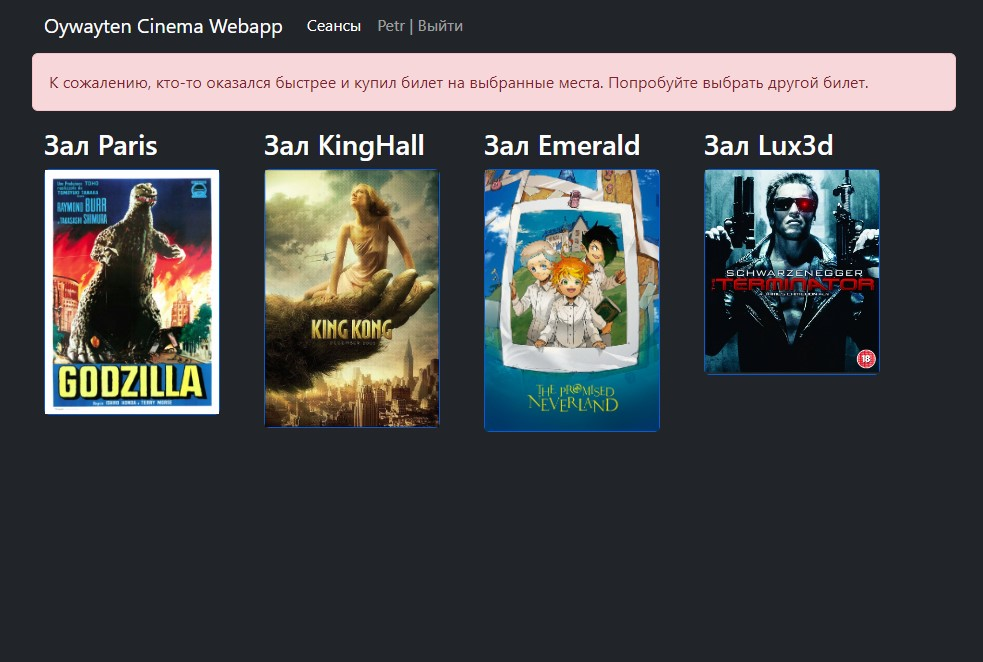

# Cinema Webapp

## О проекте
+ Веб-приложение для онлайн-продажи билетов в кино.
+ Главная страница содержит форму выбора фильма. Страница содержит изображения фильмов в виде таблицы.
+ Пользователь кликает на фильм и переходит на вид зала для выбора места.

## Использованные технологии
```text
+ Java 17;
+ Maven 4.0;
+ Spring boot;
+ Thymeleaf;
+ Bootstrap 5;
+ PostgreSQL 14;
+ JDBC;
+ Liquibase;
+ H2 1.4;
+ Log4j;
+ JUnit 5;
+ Mockito 4. 
```

## Настройка окружения

+ Рекомендуемый браузер Chrome.

1. Установить PostgreSQL: логин - postgres, пароль - password;
2. Создать БД cinema;
    ```postgres-sql
    CREATE DATABASE cinema;
    ```
3. Собрать проект и запустить приложение Spring Boot
    ```shell
    mvn clean package spring-boot:run
   ```
   
## Взаимодействие с приложением
- ## Главная страница
  
- ## Регистрация
   
- ## Вход
  
- ## Сеансы показов
  
- ## Выбор места
  
- ## Покупка билета
  
- ## Страница благодарности
  
- ## Билет занят
  


### Контакты
email: [cpc1251@mail.ru](mailto:cpc1251@mail.ru)
