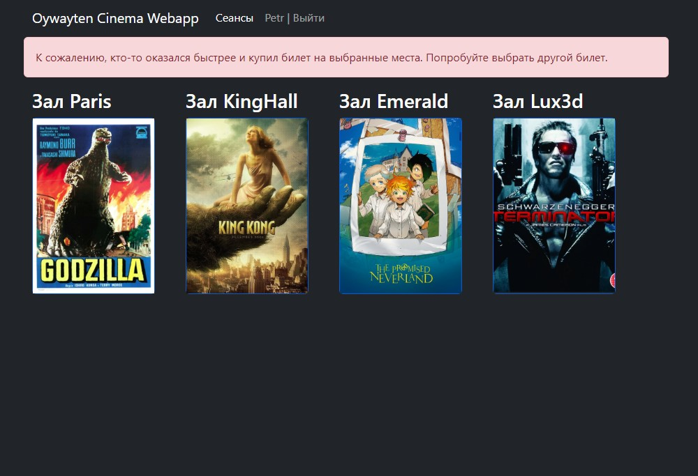

# Cinema Webapp

## About the application
+ Web application for online sale of movie tickets.
+ The main page contains a movie selection form. The page contains movie images in tables.
+ The user clicks on the movie and goes to the hall view to select a seat.

## Technology stack:
```text
+ Java 17;
+ Maven 4.0;
+ Spring boot;
+ Thymeleaf;
+ Bootstrap 5;
+ PostgreSQL 14;
+ JDBC;
+ Liquibase;
+ H2 1.4;
+ Log4j;
+ JUnit 5;
+ Mockito 4. 
```

## Application launch

+ Recommended browser is Chrome.

1. Install PostgreSQL: login - postgres, password - password;
2. Create cinema database;
    ```postgres-sql
    CREATE DATABASE cinema;
    ```
3. Build the project and run the Spring Boot application
    ```shell
    mvn clean package spring-boot:run
   ```
   
## Application interaction
- ## Main page
  
- ## Registration
   
- ## Login
  
- ## Movie sessions
  
- ## Select place
  
- ## Buy a ticket
  
- ## Thank you page
  
- ## Buy ticket fail
  


### Contacts
+ email: [oywayten+git@gmail.com](mailto:oywayten+git@gmail.com)
+ telegram: [@VitaliyJVM](https://t.me/VitaliyJVM/ "go to t.me/VitaliyJVM")
